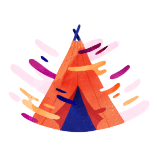
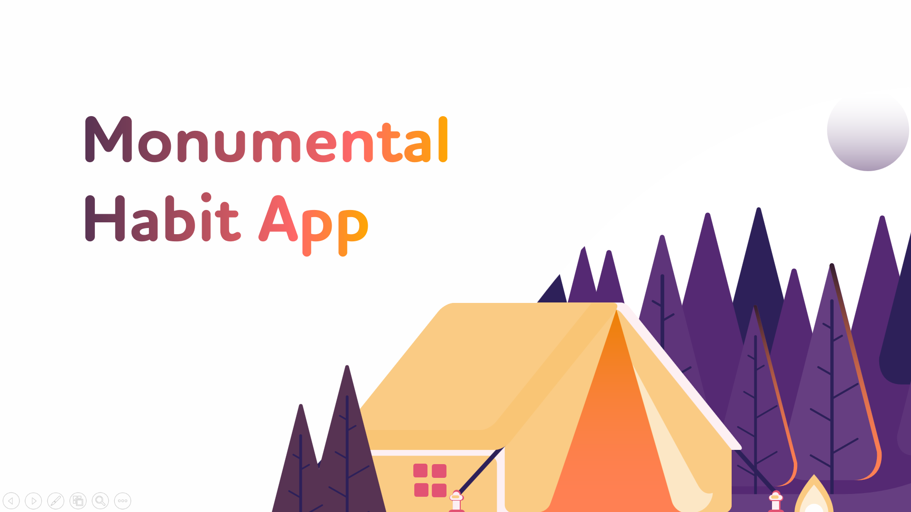
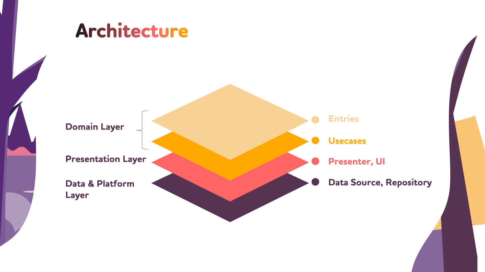
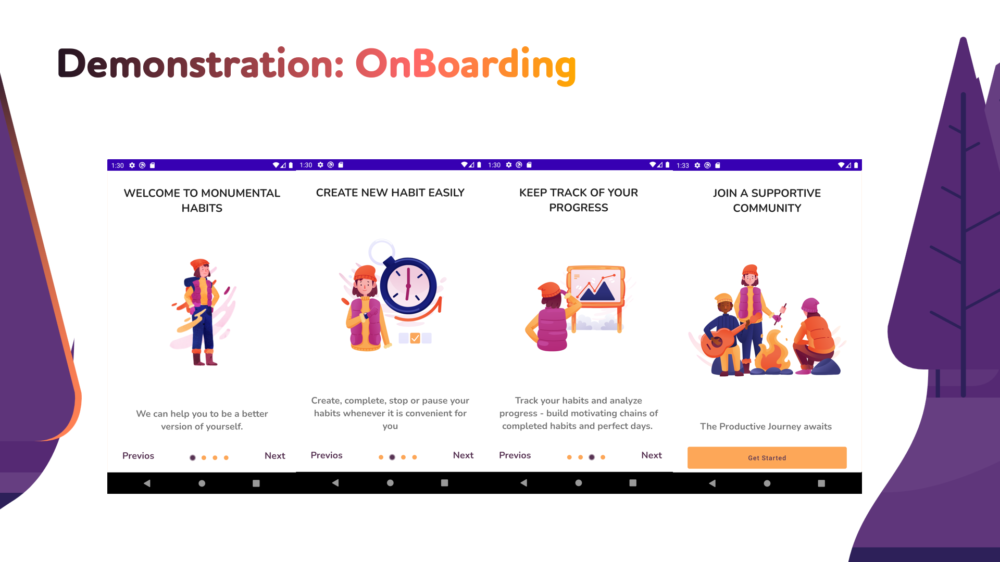
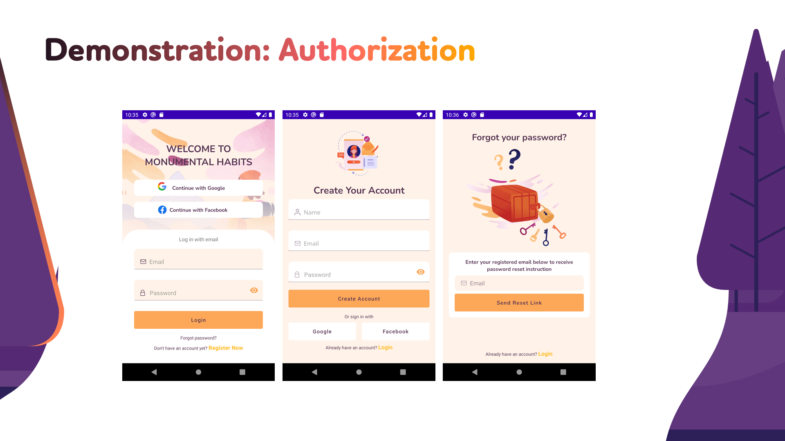
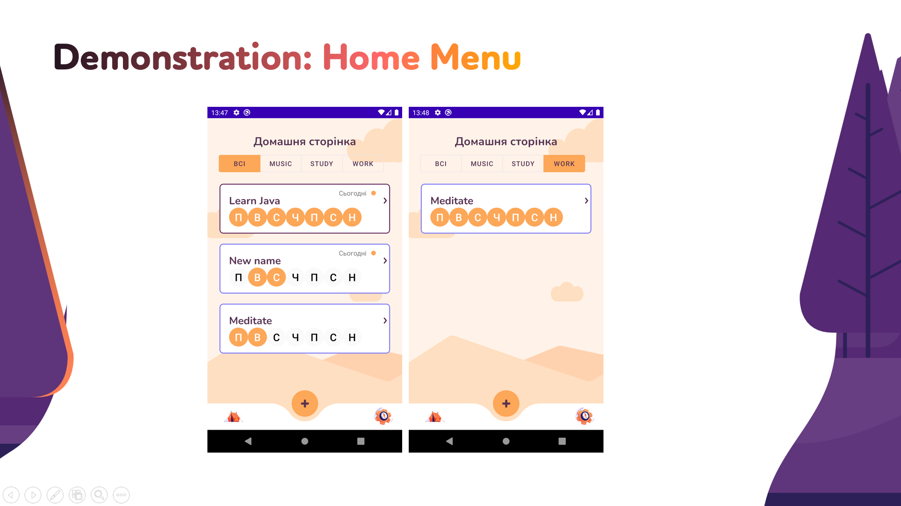
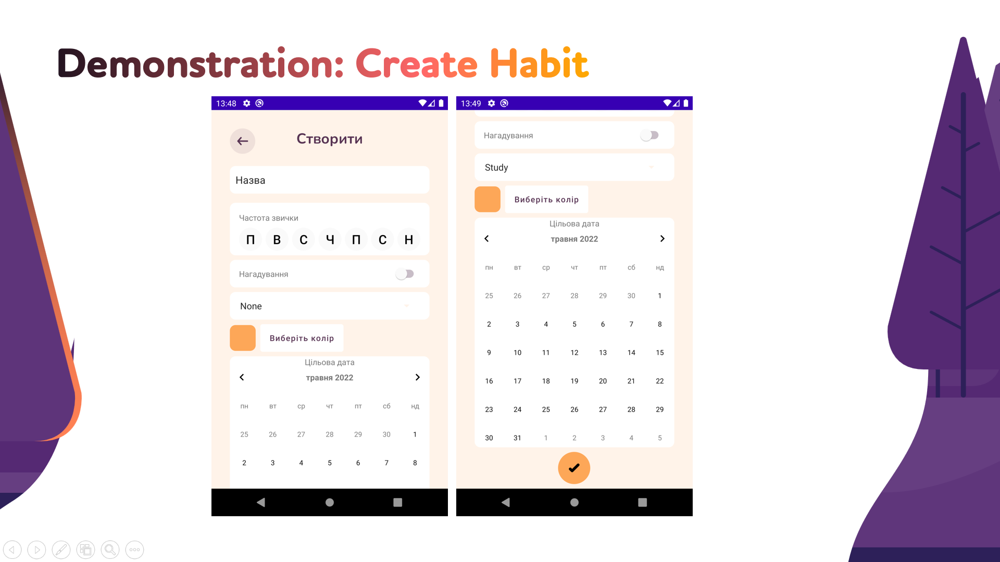
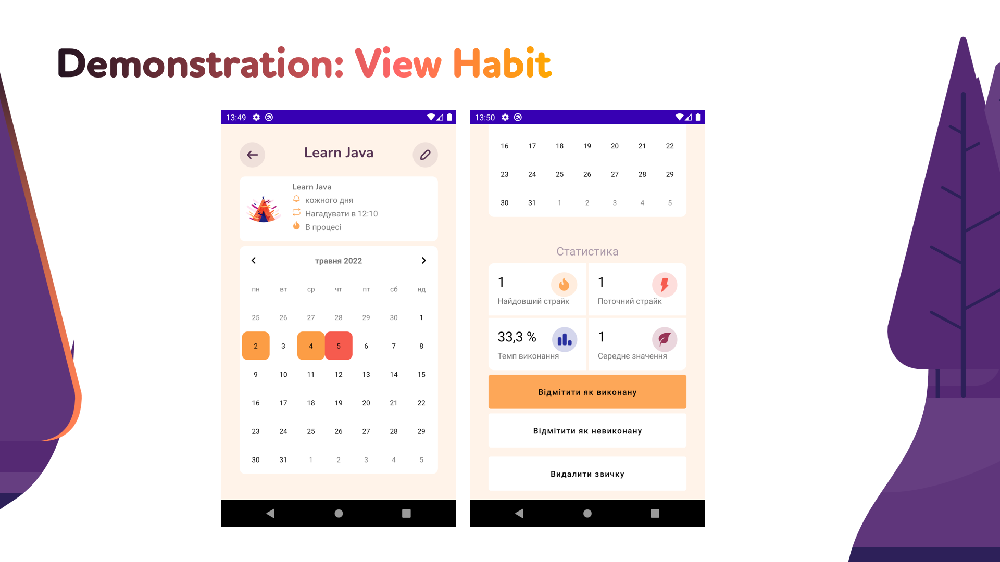
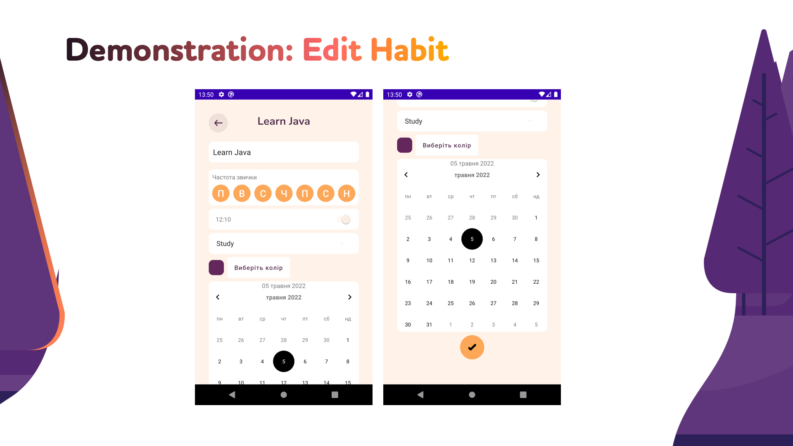
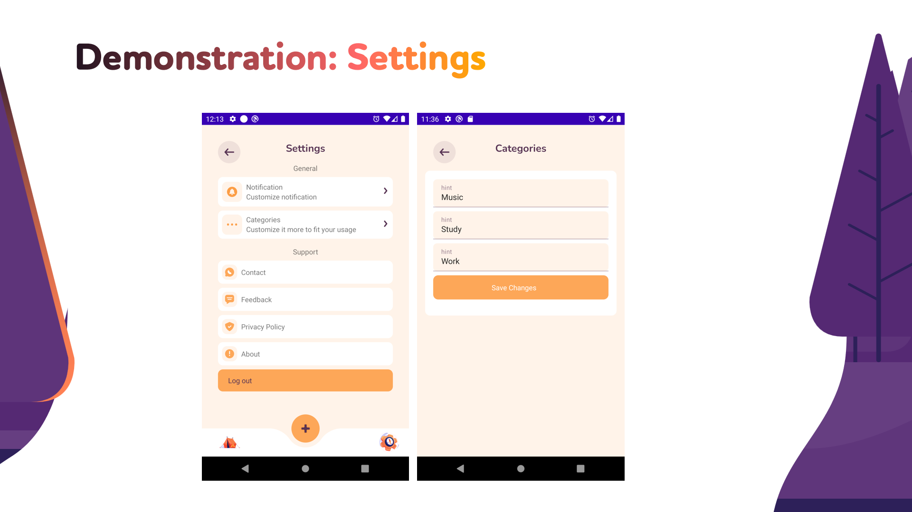

<!-- PROJECT LOGO -->
 

    
    <h2>Hobbit Tracker</h2>
     

<!-- TABLE OF CONTENTS -->

    
Table of Contents | Зміст

    <ol>
        <li><a href="#about-the-project">About The Project | Опис проекту</a></li>
        <li><a href="#about-the-project">Demonstration | Демонстрація</a></li>
        <li><a href="#contact">Contact | Контакти</a></li>
    </ol>

<!-- ABOUT THE PROJECT -->

## About The Project | Опис проекту

During this work, an application was created that is relevant today, and can help any Internet user to improve time
management skills and learn to set the right priorities for themselves, so not only have time for everything in a day,
but also have free time to himself.

-----------------
Під час даної роботи було розроблено додаток, який є актуальним сьогодні, та може допомогти будь-якому користувачеві
мережі Інтернет покращити навички тайм-менеджменту та навчитись правильно для себе виставляти пріоритети, таким чином не
просто встигати все за день, але й мати вільний час для себе.

-----------------

(<a href="#top">back to top</a>)

<!-- Demonstration -->

## Demonstration | Демонстрація

    
    
    
    
    
    
    

<!-- CONTACT -->

## Developers | Розробники

GitaristErik - [GitHub](https://github.com/GitaristErik/)

witchinthesky - [GitHub](https://github.com/witchinthesky/)

(<a href="#top">back to top</a>)

